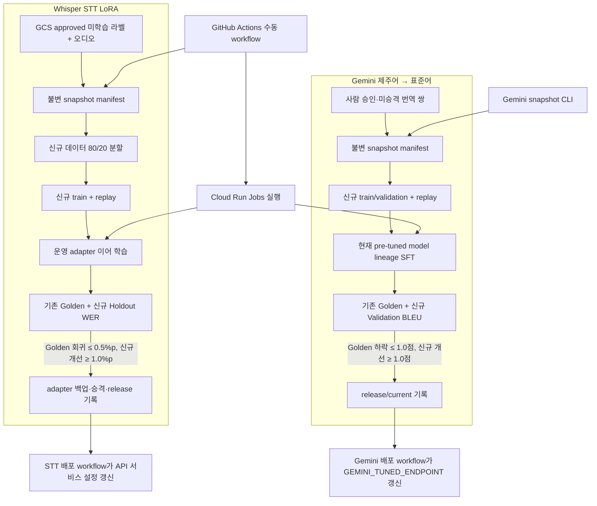

# 들엄수다 데이터 플라이휠 | Korean Heritage Flywheel

    

> 검수된 제주어 음성·번역 데이터를 고정 snapshot으로 만들고, Whisper STT LoRA와 Gemini 번역 모델 후보를 별도 평가 게이트로 검증하는 학습 파이프라인입니다.

## 프로젝트 목적

API가 모은 제주어 음성과 라벨 중 학습 가능한 항목을 사용해 새 STT adapter와 Gemini 번역 모델 버전을 만듭니다. 원본 변경 여부와 관계없이 동일 입력을 추적할 수 있도록 GCS manifest와 run 기록을 남기고, 기존 기준 데이터의 품질을 유지하면서 신규 데이터 평가에서 개선된 후보만 release로 기록합니다.

## 핵심 기능

- **STT flywheel:** 승인되고 아직 승격되지 않은 라벨에서 오디오 구간·전사 쌍을 수집해 Whisper + PEFT LoRA를 이어 학습합니다.
- **Gemini flywheel:** 사람이 검수·승인한 제주어/표준어 쌍으로 현재 tuned model lineage를 supervised fine-tuning 합니다.
- **재현 가능한 실험:** GCS generation과 입력 목록으로 content-derived snapshot ID를 만들고 manifest, run 상태, 평가 JSON, release JSON을 GCS에 보존합니다.
- **회귀 방지:** STT는 기존 Golden WER와 신규 Holdout WER, Gemini는 기존 Golden BLEU와 신규 Validation BLEU를 각각 비교합니다.
- **수동 실행 흐름:** STT snapshot은 전용 GitHub Actions `workflow_dispatch`로 만들 수 있습니다. Gemini snapshot은 CLI로 만들고, snapshot ID를 Gemini 실행 workflow에 전달합니다.

## 아키텍처



두 학습 경로는 같은 GCS bucket과 검수 데이터를 사용하지만 manifest, run, 평가 게이트, release 경로를 분리합니다. Flywheel 상태 저장에는 Firestore를 사용하지 않습니다.

## 기술 스택

| 영역 | 기술 | 사용 위치 |
|---|---|---|
| STT 학습 | Python 3.11, PyTorch, Hugging Face Transformers, Datasets, PEFT, Whisper, librosa | Whisper Small 기반 LoRA 이어 학습과 오디오 전처리 |
| STT 평가 | jiwer | Golden 및 신규 Holdout WER 계산 |
| 번역 튜닝 | Google Gen AI SDK, Vertex AI Agent Platform tuning API | 기존 pre-tuned model lineage의 supervised tuning과 endpoint 평가 |
| 번역 평가 | sacreBLEU | corpus BLEU 및 exact-match rate 계산 |
| 저장·실험 상태 | Google Cloud Storage, PyYAML | 데이터/manifest, run, evaluation, candidate, release 저장 및 YAML 설정 |
| 배치 실행 | Docker, Cloud Run Jobs | GPU 기반 STT job과 Gemini 튜닝 제어 job |
| 오케스트레이션 | GitHub Actions, Workload Identity Federation | 수동 workflow 실행 및 서비스 endpoint 설정 갱신 |

STT 학습 의존성은 [`requirements.txt`](requirements.txt), snapshot 제어용은 [`requirements-control.txt`](requirements-control.txt), Gemini 작업용은 [`requirements-gemini.txt`](requirements-gemini.txt)에 분리되어 있습니다.

## 설치 및 실행

Python 3.11과 GCP Application Default Credentials(ADC)가 필요합니다. Cloud Run/GitHub Actions는 서비스 계정 및 Workload Identity Federation으로 인증합니다.

```bash
python -m pip install -r requirements-control.txt
python -m pip install -r requirements.txt
python -m pip install -r requirements-gemini.txt
```

로컬에서 STT 또는 Gemini snapshot을 만들 때:

```bash
python -m flywheel.cli --config configs/stt.yaml snapshot
python -m flywheel.gemini_cli --config configs/gemini.yaml snapshot
```

위 명령은 생성된 `snapshot_id`와 eligible sample 수를 JSON으로 출력합니다. 해당 ID를 사용한 작업 진입점은 다음과 같습니다.

```bash
# STT train → evaluate → gate 승인 시 GCS adapter/release 승격
python -m flywheel.pipeline <snapshot_id> --config configs/stt.yaml --promote

# Gemini tuning 제출·대기·평가; 장기 작업은 --mode submit 또는 finalize로 재개
python -m flywheel.gemini_pipeline <snapshot_id> --mode wait --config configs/gemini.yaml
```

Cloud Run Job 이미지 빌드 명령은 각 Dockerfile을 따릅니다.

```bash
docker build -t jeju-stt-flywheel .
docker build -f cloudrun/Dockerfile.gemini -t jeju-gemini-flywheel .
```

운영 snapshot/job 실행과 배포 workflow는 GitHub Actions의 **Actions → workflow 선택 → Run workflow**에서 수동으로 시작합니다. Gemini workflow는 `submit`, `wait`, `finalize` 모드를 받습니다.

## 환경 변수 및 설정

학습 파라미터와 GCP 리소스 경로는 환경 변수가 아니라 YAML config에서 읽습니다.

| 설정 파일 | 주요 값 | 기본 설정 |
|---|---|---|
| [`configs/stt.yaml`](configs/stt.yaml) | 프로젝트/bucket, dataset prefix, base model, 운영 adapter, Golden·Replay manifest | `openai/whisper-small`, min samples `10`, holdout `20%`, replay ratio `1.0`, seed `42` |
| [`configs/stt.yaml`](configs/stt.yaml) | STT 승격 gate | 기존 Golden WER 퇴행 최대 `0.5%p`, 신규 Holdout WER 개선 최소 `1.0%p` |
| [`configs/gemini.yaml`](configs/gemini.yaml) | Gemini baseline endpoint·pre-tuned model, dataset/GCS 경로, 데이터 필터 | min samples `10`, validation `20%`(최소 `2`), replay ratio `1.0`, seed `42`, human review 필수 |
| [`configs/gemini.yaml`](configs/gemini.yaml) | Gemini 승격 gate | 기존 Golden BLEU 하락 최대 `1.0점`, 신규 Validation BLEU 개선 최소 `1.0점` |

GitHub Actions secrets로 `GCP_PROJECT_ID`, `GCP_WORKLOAD_IDENTITY_PROVIDER`, `GCP_FLYWHEEL_SERVICE_ACCOUNT`를 사용합니다. Cloud Run Job 배포 workflow는 `GCP_STT_RUNTIME_SERVICE_ACCOUNT`도 사용합니다. JSON service-account key 대신 Workload Identity Federation을 사용합니다.

## API 및 데이터 흐름

### 1. STT: 승인 음성에서 새 adapter까지

1. `dataset/extracted/Text/` 아래 JSON을 읽고 `status` 또는 `review_status`가 `approved`이며 `training_status.stt.promoted`가 아닌 라벨을 고릅니다. API의 단일 샘플 라벨과 기존 `utterance[]` 구간 라벨을 모두 처리합니다.
2. 대응 WAV는 라벨의 `audio_filepath` 또는 `dataset/extracted/Audio/{id}.wav`에서 찾습니다. label GCS generation을 포함한 manifest 목록으로 SHA-256 기반 snapshot ID를 만들며, snapshot 생성 lock과 create-only 객체 쓰기로 중복 생성을 막습니다. 현재 설정의 최소 수집량은 10개입니다.
3. 신규 데이터는 seed `42`로 안정적으로 80% train / 20% holdout으로 나눕니다. train에는 새 train 예시와 최대 같은 수의 고정 replay 예시를 합칩니다(`replay_ratio: 1.0`).
4. 기존 운영 adapter를 로드해 2 epoch 이어 학습합니다. 학습 구현은 per-device batch size `4`, gradient accumulation `4`, learning rate `1e-4`를 사용합니다. GPU가 있으면 FP16을 사용합니다.
5. 운영 adapter와 후보 adapter 각각을 기존 Golden manifest와 신규 snapshot Holdout에서 추론해 WER를 계산합니다. 두 gate를 모두 통과하고 작업에 `--promote`가 지정됐을 때만 운영 prefix를 변경합니다.
6. 승격 전 기존 adapter를 GCS backup prefix에 복사하고 후보를 운영 prefix에 복사한 뒤, release 및 `releases/current.json`을 기록하고 학습한 원본 라벨에 승격 상태를 표시합니다.

### 2. Gemini: 사람 검수 번역 쌍에서 tuned endpoint까지

1. 동일한 Text JSON prefix에서 승인 상태, `reviewed_by: human`, `dialect_form`, `standard_form`이 있는 항목 중 이미 Gemini 승격된 데이터가 아닌 항목만 선택합니다. 자동 승인된 라벨은 Gemini 정답 ground truth로 사용하지 않습니다.
2. generation과 제주어/표준어 텍스트로 snapshot ID와 불변 JSONL manifest를 만들며 현재 최소 수는 10쌍입니다.
3. seed `42` 기준으로 신규 데이터의 20%(최소 2쌍)를 validation으로 고정합니다. 나머지 신규 train에 최대 동일 수의 replay 번역 쌍을 합쳐 GCS tuning dataset을 생성합니다.
4. 처음에는 설정된 pre-tuned model을, 이후에는 `releases/current.json`의 모델 버전을 이어서 Vertex AI Agent Platform supervised tuning job을 제출합니다. Gemini job은 `submit`, `wait`, `finalize`로 상태를 보존해 재개할 수 있습니다.
5. source endpoint와 후보 endpoint의 기존 Golden 및 신규 validation 번역을 각각 생성합니다. `sacreBLEU` corpus BLEU(tokenize=`none`, 0–100 scale)와 exact-match rate를 기록합니다. Golden BLEU 회귀와 validation BLEU 개선 gate를 모두 통과할 때 후보를 approved로 기록합니다.
6. 승인 시 release와 `releases/current.json`을 GCS에 기록하고 snapshot의 학습 샘플을 Gemini 승격 처리합니다. Run Gemini workflow는 승인된 evaluation을 확인해 Cloud Run API 서비스의 `GEMINI_TUNED_ENDPOINT`를 후보 endpoint로 갱신합니다.

### 저장 산출물

| Artifact | STT prefix | Gemini prefix | 용도 |
|---|---|---|---|
| Snapshot | `flywheel/stt/snapshots/{id}/manifest.jsonl` | `flywheel/gemini/snapshots/{id}/manifest.jsonl` | 학습 입력 고정 |
| Run state | `flywheel/stt/runs/{id}/run.json` | `flywheel/gemini/runs/{id}/run.json` | snapshot부터 평가까지 작업 상태 |
| Candidate | `flywheel/stt/candidates/{id}/adapter/` | Vertex AI tuned model endpoint | 검증 대상 모델 |
| Evaluation | `flywheel/stt/evaluations/{id}.json` | `flywheel/gemini/evaluations/{id}.json` | baseline/candidate score 및 gate 결과 |
| Release | `flywheel/stt/releases/{release}.json`, `releases/current.json` | `flywheel/gemini/releases/gemini-{id}.json`, `releases/current.json` | 승인된 모델 버전 기록 |

### API 배포 연동

승격 후 workflow가 Cloud Run API 서비스 설정을 갱신하는 방식은 두 모델이 다릅니다. Gemini workflow는 API 코드가 읽는 `GEMINI_TUNED_ENDPOINT`를 설정합니다. STT workflow는 승인 시 `STT_RELEASE_MANIFEST_PATH`를 설정하지만, 현재 API 저장소의 모델 로더는 `LORA_MODEL_PATH`에서 adapter 경로를 읽습니다. 따라서 workflow가 승격 manifest 경로를 설정하는 사실과 API가 그 값을 실제 적용하는지는 별도로 구분해 관리해야 합니다.

## 디렉터리 구조

```text
.
├── .github/workflows/        # 수동 snapshot, 실행, 배포 workflow
├── cloudrun/
│   ├── Dockerfile.gemini     # Gemini 튜닝 제어 작업 이미지
│   └── stt-flywheel-job.yaml
├── configs/
│   ├── stt.yaml              # STT data/model/split/승격 gate
│   └── gemini.yaml           # Gemini endpoint/data/split/승격 gate
├── flywheel/
│   ├── cli.py                # STT snapshot 및 baseline 생성
│   ├── pipeline.py           # STT 학습 → 평가 → 승격 조정
│   ├── dataset.py            # 승인 데이터 검색·정규화·분리
│   ├── train_stt.py          # Whisper PEFT adapter 이어 학습
│   ├── evaluate_stt.py       # STT Golden/Holdout WER
│   ├── promote_stt.py        # backup 및 STT release 기록
│   ├── gemini_cli.py         # Gemini snapshot 및 baseline 생성
│   ├── gemini_pipeline.py    # Gemini submit/wait/finalize 진입점
│   └── gemini_flywheel.py    # 번역 쌍 tuning, BLEU 평가, release
├── Dockerfile                # CUDA 기반 STT job 이미지
├── requirements.txt          # STT worker
├── requirements-control.txt  # GCS snapshot control
└── requirements-gemini.txt   # Gemini job
```

## 학습 및 평가 지표

### 파이프라인 승격 gate

| 파이프라인 | 평가 세트 | 측정값 | 승인 조건 |
|---|---|---|---|
| STT | 기존 Golden + 신규 Holdout | `jiwer` WER(%) | Golden WER 퇴행 ≤ `0.5%p` **그리고** 신규 Holdout WER 개선 ≥ `1.0%p` |
| Gemini | 기존 Golden + 신규 Validation | `sacreBLEU` corpus BLEU(0–100); exact-match rate도 기록 | Golden BLEU 하락 ≤ `1.0점` **그리고** 신규 Validation BLEU 개선 ≥ `1.0점` |

현재 설정은 snapshot 최소량 10과 validation 최소 2를 사용합니다. Golden/replay baseline manifest는 STT `300` 발화/`3,000` 발화, Gemini `300`쌍/`3,000`쌍을 bootstrap CLI 기본값으로 생성할 수 있습니다. 각 실행의 실제 표본 수와 score는 `evaluations/{snapshot_id}.json`에 기록됩니다.

### 발표 자료 결과

아래는 사용자가 제공한 발표 이미지의 카카오브레인 제주어 데이터 200개 샘플 비교입니다. 이 표는 발표 결과이며 매 workflow가 자동으로 다시 산출하는 고정값은 아닙니다.

| 지표 | 베이스 모델 | 제주어 파인튜닝 | 파인튜닝 + 플라이휠 | 파인튜닝 변화 | 플라이휠 추가 변화 | 전체 변화 |
|---|---:|---:|---:|---:|---:|---:|
| WER (낮을수록 좋음) | 62.38% | 48.42% | **46.67%** | −13.96%p | −1.75%p | **−15.71%p** |
| BLEU (높을수록 좋음) | 57.78 | 89.14 | **90.03** | +31.36점 | +0.89점 | **+32.25점** |

## 관련 저장소

- [Korean Heritage Web](https://github.com/sunghopp/Korean-Heritage-WEB)
- [Korean Heritage API Server](https://github.com/sunghopp/Korean-Heritage-API-SVR)
